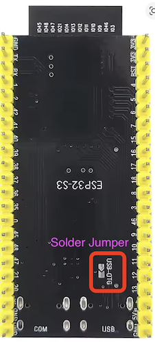

| Supported Targets | ESP32-S3 |
| ----------------- | -------- |

# RigExpert ShackMaster Power 600 
Control Software

## Overview

This project is designed run on a [Espressif ESP32-S3](https://docs.espressif.com/projects/esp-idf/en/latest/esp32s3/get-started/)  board which is equipped with WiFi and 2 USB ports.

* The USB-C port marked `COM` is used for programming and debugging the board.
* The ShackMaster 600 is connected to the second USB-C port marked USB and acts as a HID device.
* The USB port on the board is configured as a HID host.
* USB-OTG solder jumper muct be bridged (see hardware note below)

## IDE
This project is develped in Visual Studio Code with Expressif ESP-IDF extension installed.

### Configure the project

Open the project configuration menu (`idf.py menuconfig`).

In the `WiFi Configuration` menu:

* Set the Wi-Fi configuration.
    * Set `WiFi SSID`.
    * Set `WiFi Password`.

Optional: If you need, change the other options according to your requirements.

## Startup options

After startup the RGB LED will light up Magenta for a couple of seconds. If the boot button is pressed during this time, the board will start a WiFi access point.  
If the button is not pressed, the board will start a WiFi client and attempt to connect to the previously configured WiFi network.

## WiFi AP

This mode allows the a device to connect to the WiFi network provided by the board. SSID and password is set in project configuration mentioned above.

Once connected to the Board WiFi AP, browse to 192.168.4.1 and use the browser to set your netowrk SSID and password. Then press the **RESET** button on the board and wait until it connects your network.

## Important Hardware Note

The ShackMaster600 USB interface requires 5V to be present at the port. Whilst a computer or USB hub provides the 5V supply, the ESP32-S3 board does not link the power of the COM USB port to the secondary USB port.

The board contains a solder jumper marked "USB-OTG" on the back of the PCB. Bridging this jumper will link the 5V rail of both USB ports and therefore provide power to the ShackMaster 600 USB port. Without this bridge USB communication will not work.

## Build and Flash

Build the project and flash it to the board, then run the monitor tool to view the serial output:

Run `idf.py -p PORT flash monitor` to build, flash and monitor the project.

(To exit the serial monitor, type ``Ctrl-]``.)

See the Getting Started Guide for all the steps to configure and use the ESP-IDF to build projects.

* [ESP-IDF Getting Started Guide on ESP32](https://docs.espressif.com/projects/esp-idf/en/latest/esp32/get-started/index.html)
* [ESP-IDF Getting Started Guide on ESP32-S2](https://docs.espressif.com/projects/esp-idf/en/latest/esp32s2/get-started/index.html)
* [ESP-IDF Getting Started Guide on ESP32-C3](https://docs.espressif.com/projects/esp-idf/en/latest/esp32c3/get-started/index.html)

